# Hackintosh

My first Hackintosh was built in 2008 or 2009 and I only remember that it was very similar to the Frankestein's monster: Core 2 Duo CPU, some kind of AGP GPU, 4 GB of RAM. Neverthless it was able to run latest of iAtkos builds of OS X Tiger and vanilla OS X Leopard. The second version of Hackintosh was bult in 2013 and it's final EFI is in this repo. And the final version was built from scratch at December 2019. All of my Hackintoshes are able to dual-booting to Windows.

[Version 2](#version-2) and [Version 3](#version-3-pcpartpicker-link) first of all were built for the iOS and macOS development. So it's stability and work predictability was a key requirement. After all of these years using Hackintosh for the development I only can say that it worth it.

In this guide only the latest build of Hackintosh will be described.

## Table of Content
1. 👷 [The builds](#the-builds)
2. 📀 [Make installation media](#make-installation-media)
3. 🍀 [Clover installation](#clover-installation)
4. ⚙️ [Required kexts](#required-kexts)
5. 🔮 [Clover configuration](#clover-configuration)
6. 🛠 [Fix CPU Type in About This Mac](#fix-cpu-type-in-about-this-mac)
7. ✅ [What works](#what-works)
8. 🤬 [What doesn't work](#what-doesnt-work)
9. 🔥 [Benchmarks](#benchmarks)

## The builds
### [Version 2](https://github.com/Galeas/hackintosh/tree/0c6fb64803c1e47f54158bc6fd50eb2e586dfaad)
| Birthday     | Autumn 2013                    |
|--------------|--------------------------------|
| SMBIOS Model | iMac14,2	                      |
| Motherboard  | Gigabyte GA-Z87X-D3H           |
| CPU          | Intel Core i5-4570             |
| ~~GPU~~          | ~~XFX HD 5750~~ |
| GPU          | Gigabyte R9-270X 2GB Windforce |
| RAM          | 2 x Team Elite DDR-3 1600 4 GB |
| WiFi / BT    | Broadcom BCM94360 |

### Version 3 ([PCPartPicker link](https://pcpartpicker.com/list/t3vkf9))
| Birthday     | December 2019               |
|--------------|-----------------------------|
| SMBIOS Model | iMac19,1                    |
| Motherboard  | ASUS Prime Z370-A II        |
| CPU          | Intel Core i7-9700K         |
| GPU          | Sapphire RX 5700XT Nitro+   |
| RAM          | 2 x Crucial DDR-4 3200 8 GB |
| WiFi / BT    | Broadcom BCM94360 |

## Make installation media
1. Download [macOS Catalina](https://apps.apple.com/ru/app/macos-catalina/id1466841314?mt=12) installer from the Mac AppStore
2. Format your USB (at least 16 GB) with **Journaled HFS+ / GUID**.
3. Create native installer media with following
```bash
sudo "/Applications/Install macOS Mojave.app/Contents/Resources/createinstallmedia" --volume /Volumes/<#YOUR_USB_NAME#>
```

## Clover installation
1. Download the latest Clover Bootloader installer from [HERE](https://github.com/Dids/clover-builder/releases) and [Clover Configurator](https://mackie100projects.altervista.org/download-clover-configurator/)
2. Clover installation options should be:
    * Install Clover for UEFI booting only
    * Install Clover to the ESP
    * UEFI Drivers
        * AptioMemoryFix
        * HFSPlus
        * ApfsDriverLoader
        
As far as I'm using Z370 chipset which had native NVRAM support, I don't need to emulate it. So leave the EmuVariableUefi unselected.

## Required kexts
This section is very trivial for the modern hackintoshing :)

**IMPORTANT** Always use the latest versions of kexts, it can save you from some sleepless nights.
* Generic patching: [Lilu](https://github.com/acidanthera/Lilu/releases)
* Sound: [AppleALC](https://github.com/acidanthera/applealc/releases)
* Ethernet: [IntelMausi](https://github.com/acidanthera/IntelMausi/releases)
* GPU: [WhateverGreen](https://github.com/acidanthera/WhateverGreen/releases)
* SMC Emulation: [VirtualSMC](https://github.com/acidanthera/VirtualSMC/releases)
    * SMCProcessor
    * SMCSuperIO
* USB Injection: [USBInjectAll](https://bitbucket.org/RehabMan/os-x-usb-inject-all/downloads/RehabMan-USBInjectAll-2018-1108.zip)

## Clover configuration
As far as this tutorial is made after macOS Catalina **10.15.2**, which natively supports [RDNA GPUs](https://en.wikipedia.org/wiki/RDNA_(microarchitecture)), was released, we don't have to make different Clover configurations for installation and regular running of our hackintosh. Anyway, Clover's `config.plist` has very simple content in our case.
* <details><summary>ACPI</summary>
    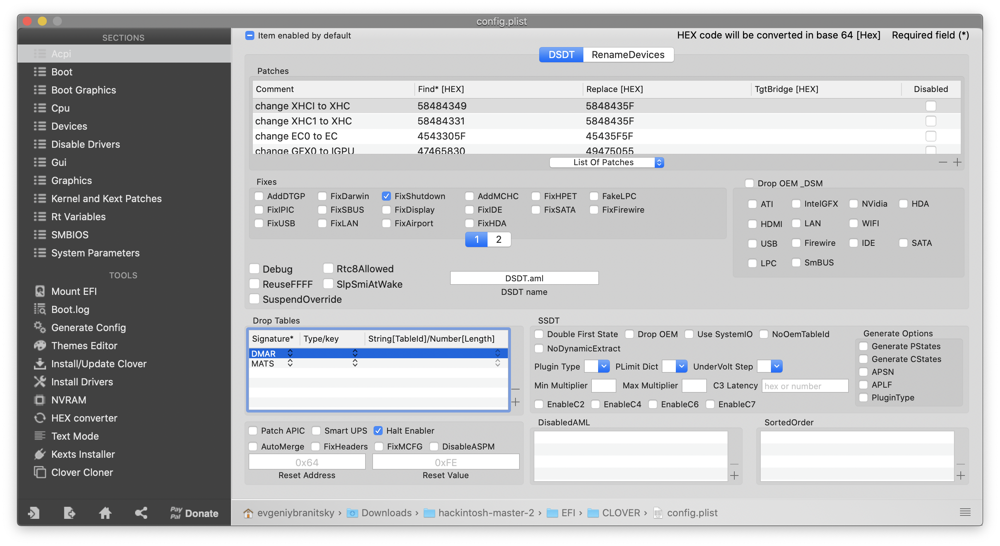
    
    ```xml
    <key>ACPI</key>
    <dict>
        <key>DSDT</key>
        <dict>
            <key>Debug</key>
            <false/>
            <key>DropOEM_DSM</key>
            <false/>
            <key>Fixes</key>
            <dict>
                <key>FixShutdown</key>
                <true/>
                <key>FixWAK</key>
                <false/>
            </dict>
            <key>Name</key>
            <string>DSDT.aml</string>
            <key>Patches</key>
            <array>
                <dict>
                    <key>Comment</key>
                    <string>change XHCI to XHC</string>
                    <key>Disabled</key>
                    <false/>
                    <key>Find</key>
                    <data>
                    WEhDSQ==
                    </data>
                    <key>Replace</key>
                    <data>
                    WEhDXw==
                    </data>
                </dict>
                <dict>
                    <key>Comment</key>
                    <string>change XHC1 to XHC</string>
                    <key>Disabled</key>
                    <false/>
                    <key>Find</key>
                    <data>
                    WEhDMQ==
                    </data>
                    <key>Replace</key>
                    <data>
                    WEhDXw==
                    </data>
                </dict>
                <dict>
                    <key>Comment</key>
                    <string>change EC0 to EC</string>
                    <key>Disabled</key>
                    <false/>
                    <key>Find</key>
                    <data>
                    RUMwXw==
                    </data>
                    <key>Replace</key>
                    <data>
                    RUNfXw==
                    </data>
                </dict>
                <dict>
                    <key>Comment</key>
                    <string>change GFX0 to IGPU</string>
                    <key>Disabled</key>
                    <false/>
                    <key>Find</key>
                    <data>
                    R0ZYMA==
                    </data>
                    <key>Replace</key>
                    <data>
                    SUdQVQ==
                    </data>
                </dict>
                <dict>
                    <key>Comment</key>
                    <string>change SAT0 to SATA</string>
                    <key>Disabled</key>
                    <false/>
                    <key>Find</key>
                    <data>
                    U0FUMA==
                    </data>
                    <key>Replace</key>
                    <data>
                    U0FUQQ==
                    </data>
                </dict>
                <dict>
                    <key>Comment</key>
                    <string>change PEGP to GFX0</string>
                    <key>Disabled</key>
                    <false/>
                    <key>Find</key>
                    <data>
                    UEVHUA==
                    </data>
                    <key>Replace</key>
                    <data>
                    R0ZYMA==
                    </data>
                </dict>
            </array>
            <key>ReuseFFFF</key>
            <false/>
        </dict>
        <key>DropTables</key>
        <array>
            <dict>
                <key>Signature</key>
                <string>DMAR</string>
            </dict>
            <dict>
                <key>Signature</key>
                <string>MATS</string>
            </dict>
        </array>
        <key>HaltEnabler</key>
        <true/>
        <key>SSDT</key>
        <dict>
            <key>DropOem</key>
            <false/>
            <key>Generate</key>
            <dict>
                <key>CStates</key>
                <false/>
                <key>PStates</key>
                <false/>
                <key>PluginType</key>
                <false/>
            </dict>
        </dict>
    </dict>
    ```
</details>

* <details><summary>Boot</summary>
    I'd also recommend to use <code>debug=0x100</code>, <code>keepsyms=1</code> and <code>-v</code> for an installation and post-installation debug.<br/>
    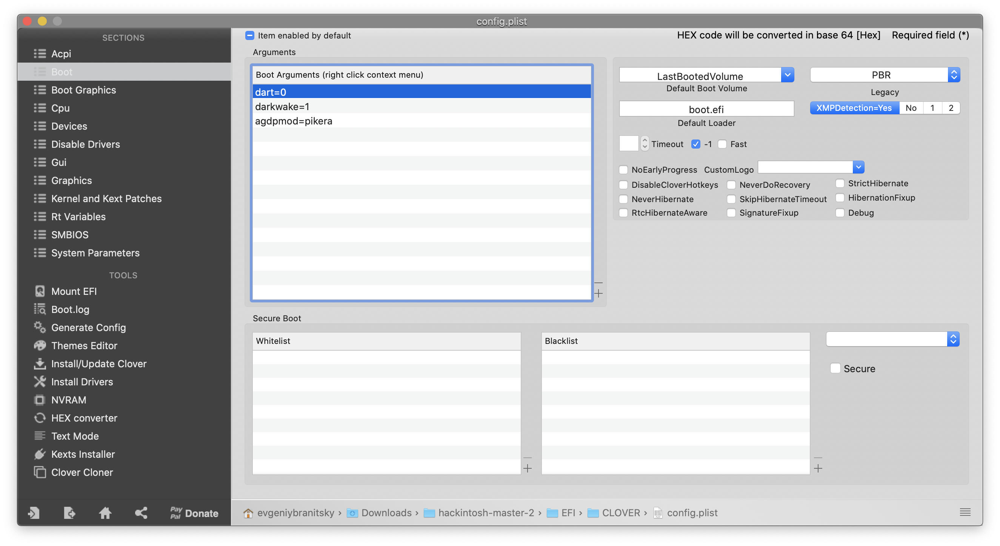

    ```xml
    <key>Boot</key>
    <dict>
        <key>Arguments</key>
        <string>dart=0 darkwake=1 agdpmod=pikera</string>
        <key>Debug</key>
        <false/>
        <key>DefaultLoader</key>
        <string>boot.efi</string>
        <key>DefaultVolume</key>
        <string>LastBootedVolume</string>
        <key>Legacy</key>
        <string>PBR</string>
        <key>Secure</key>
        <false/>
        <key>Timeout</key>
        <integer>-1</integer>
        <key>XMPDetection</key>
        <string>Yes</string>
    </dict>
    ```
</details>

* <details><summary>Cpu (<a href="#fix-cpu-type-in-about-this-mac">explanation</a>)</summary>
    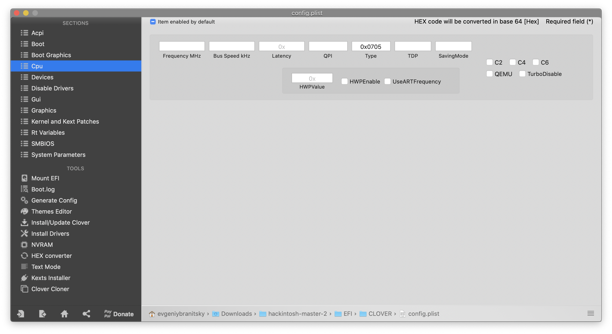

    ```xml
    <key>CPU</key>
    <dict>
        <key>Type</key>
        <string>0x0705</string>
        <key>UseARTFrequency</key>
        <false/>
    </dict>
    ```
</details>

* <details><summary>Devices</summary>
    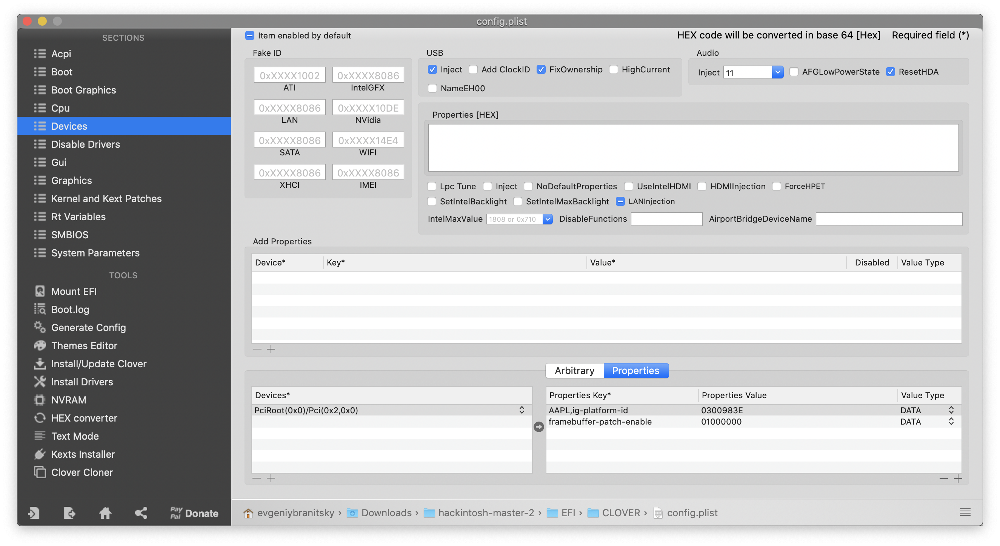

    ```xml
    <key>Devices</key>
    <dict>
        <key>Audio</key>
        <dict>
            <key>Inject</key>
            <integer>11</integer>
            <key>ResetHDA</key>
            <true/>
        </dict>
        <key>Properties</key>
        <dict>
            <key>PciRoot(0x0)/Pci(0x2,0x0)</key>
            <dict>
                <key>AAPL,ig-platform-id</key>
                <data>
                    AwCYPg==
                </data>
                 <key>framebuffer-patch-enable</key>
                <data>
                    AQAAAA==
                </data>
            </dict>
        </dict>
        <key>USB</key>
        <dict>
            <key>AddClockID</key>
            <false/>
            <key>FixOwnership</key>
            <true/>
            <key>Inject</key>
            <true/>
        </dict>
    </dict>
    ```
</details>

* <details><summary>Kernel and kexts patches</summary>
    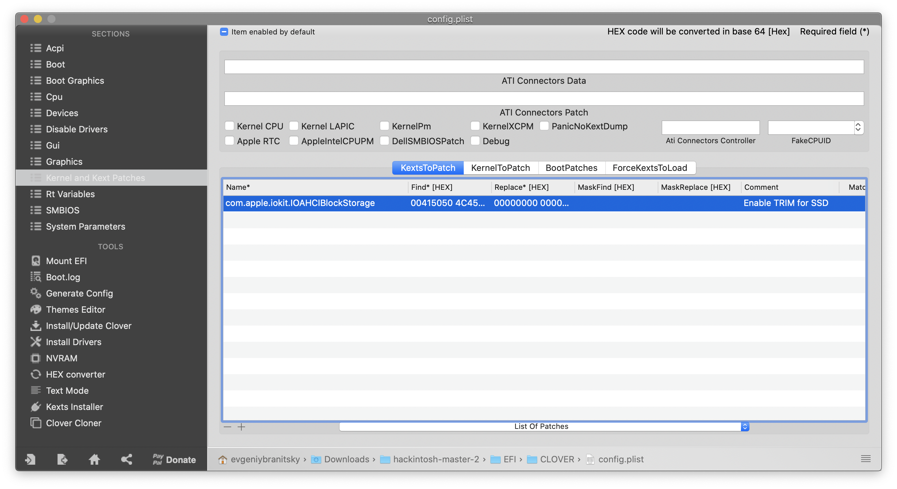
  
    ```xml
    <key>KernelAndKextPatches</key>
    <dict>
    <key>AppleIntelCPUPM</key>
    <false/>
    <key>AppleRTC</key>
    <false/>
    <key>Debug</key>
    <false/>
    <key>DellSMBIOSPatch</key>
    <false/>
    <key>KernelCpu</key>
    <false/>
    <key>KernelLapic</key>
    <false/>
    <key>KernelPm</key>
    <false/>
    <key>KernelXCPM</key>
    <false/>
    <key>KextsToPatch</key>
    <array>
        <dict>
            <key>Comment</key>
            <string>Enable TRIM for SSD</string>
            <key>Disabled</key>
            <false/>
            <key>Find</key>
            <data>
            AEFQUExFIFNTRAA=
            </data>
            <key>InfoPlistPatch</key>
            <false/>
            <key>Name</key>
            <string>com.apple.iokit.IOAHCIBlockStorage</string>
            <key>Replace</key>
            <data>
            AAAAAAAAAAAAAAA=
            </data>
        </dict>
    </array>
    </dict>
    ```
</details>

* <details><summary>Rt Variables</summary>
    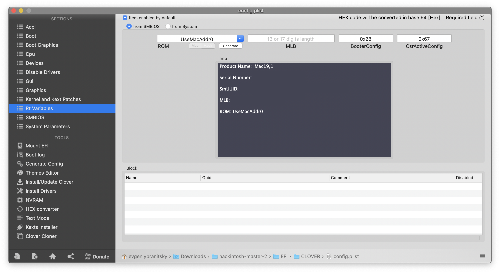

    - ROM - UseMacAdd0
    - BooterConfig - 0x28
    - CsrActiveConfig - 0x67
</details>

* <details><summary>SMBIOS: Generate SMBIOS for iMac19,1</summary>
    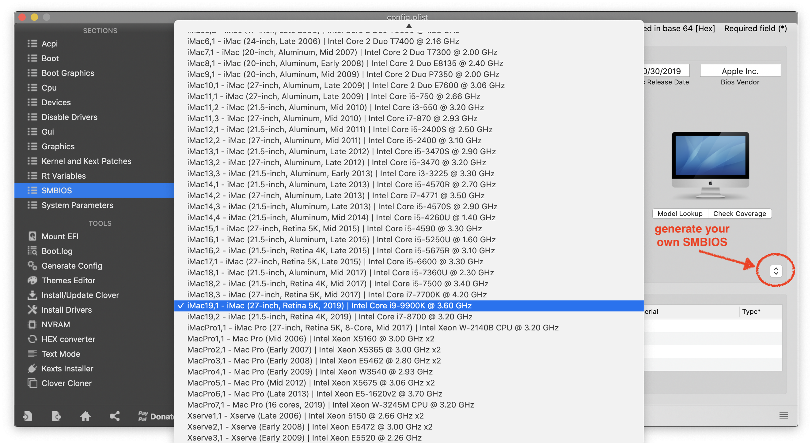
</details>

* <details><summary>System Parameters</summary>
    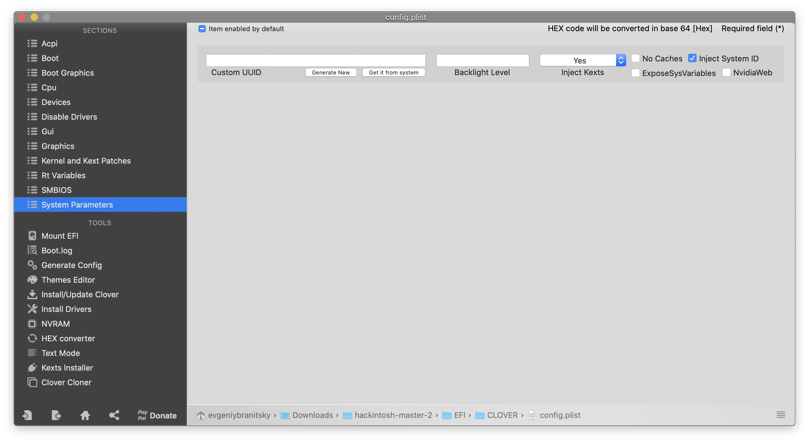

    - Inject Kexts - Yes
    - ✔︎ Inject System ID
</details>

**NOTE**: Fore more information you could visit [Coffee Lake Vanilla Hackintosh Guide](https://hackintosh.gitbook.io/-r-hackintosh-vanilla-desktop-guide/config.plist-per-hardware/coffee-lake)

## Fix CPU Type in About This Mac
For some reason, About This Mac and System Report do not properly identify the processor and list it as an `Intel Core i9` instead of an `Intel Core i7`. This can easily be fixed by using Clover Configurator to set the `CPU Type` to `0x0705` and rebooting.

## What works
* Onboard audio
* iMessage (with [this guide](https://www.tonymacx86.com/threads/an-idiots-guide-to-imessage.196827/))
* Intel's QuickSync
* HEVC
* Wireless communications (because **Broadcom BCM94360** is used in a real iMacs and supported natively)
   - WiFi
   - Bluetooth LE
   - Handoff
   - Continuity
   - AirDrop
   - Airplay
* Ethernet
* CPU's native power management
* NightShift

## What doesn't work
* DRM video in Safari (Netflix and Amazon Prime)
   - works fine in Google Chrome


## Benchmarks
* Geekbench 5
    * [CPU](https://browser.geekbench.com/v5/cpu/819499)
        * Single core: 1353
        * Multy core: 7625
    * [OpenCL](https://browser.geekbench.com/v5/compute/344944): 45467
    * [Metal](https://browser.geekbench.com/v5/compute/344947): 37592
* Cinebench R20: 
    - <details><summary>Single Core: 474</summary>
        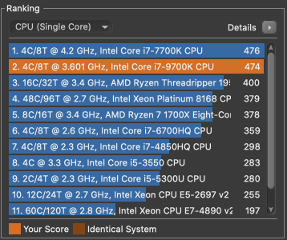
    </details>
    
    - <details><summary>Multy Core: 3553</summary>
        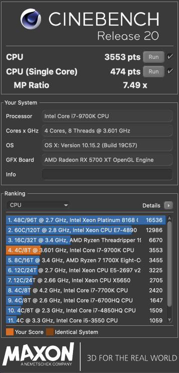
    </details>
* <details><summary>LuxMark (LuxBall): 30443</summary>
    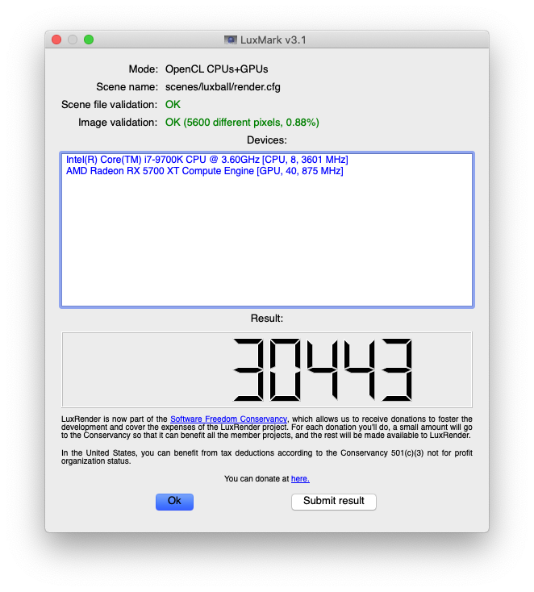
</details>
